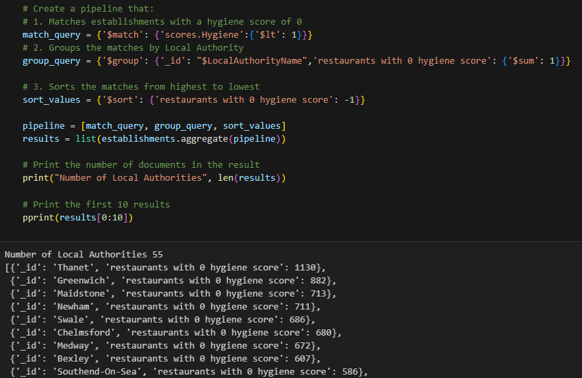

# nosql-challenge
In this challenge, a non-relational database is updated with information about a new restaurant.  The PyMongo library is used to work with MongoDB.

In addition, analysis is done on the existing documents to find restaurants with the best hygiene rating (weirdly, 0 is best).  An aggregation pipeline is used for this analysis.  Results are saved in a Pandas dataframe.

There is a separate Jupyter notebook for updating the database(NoSQL_setup), and another for the analysis(NoSQL_analysis).  Both have also been exported to python files.
